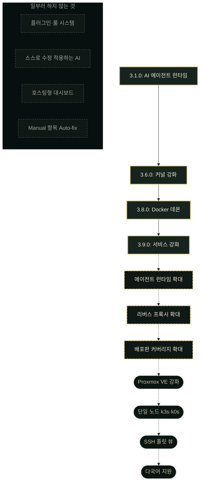

# Hostveil

[English](README.md) · **한국어**

> 2026-1 Ajou SoftCon 개발부문 최우수상 수상

**Hostveil은 셀프호스팅 중인 리눅스 서버의 보안 실수를 찾아, 쉬운 말로 설명하고, 안전하게 고쳐 줍니다.**
바이너리 하나, 설정 파일 없음, 클라우드 계정 없음. 모든 수정은 미리 보여 주고,
백업하고, 명령 한 줄로 되돌릴 수 있습니다.

[](https://github.com/seolcu/hostveil/actions/workflows/ci.yml)
[](https://github.com/seolcu/hostveil/releases/latest)
[](go.mod)
[](LICENSE)

[웹사이트](https://hostveil.seolcu.com/ko/) · [문서](https://hostveil.seolcu.com/ko/docs/) · [변경 이력](CHANGELOG.ko.md) · [최신 릴리스](https://github.com/seolcu/hostveil/releases/latest)

<p align="center">
  
</p>

---

Jellyfin이나 Nextcloud, 게임 서버, 로컬 LLM, OpenClaw나 Hermes Agent 같은
셀프호스팅 AI 에이전트까지, 이런 서버 대부분은 설치할 때의 기본값을 그대로
씁니다. 기본값 하나만 잘못 두어도 서버를 통째로 잃을 수
있습니다. Hostveil을 실행하면 중요한 곳부터 점검해 0–100 점수 하나로 알려 주고,
문제마다 전문 용어 없이 설명한 다음 고칠지 물어봅니다. 무엇이 바뀌는지 먼저 보여
주고 원본을 백업한 뒤 고치며, 어떤 수정이든 명령 하나로 되돌릴 수 있습니다.

## 정말 효과가 있나요?

Hostveil이 고친 뒤에 Hostveil의 점수가 오르는 것만으로는 아무것도 증명되지
않습니다. 무엇이 문제이고 고친 뒤 점수가 얼마여야 하는지를 같은 코드가 정하기
때문입니다. 그래서 이 저장소는 Hostveil을 전혀 모르는 도구로 시드 호스트를
측정하는 하네스를 갖고 있습니다. Lynis, Docker의 CIS 벤치마크, 호스트 밖에서 쏘는
TCP 스캔, 커널이 직접 알려 주는 수신 소켓 목록입니다. 시드 구성은 Nextcloud와
PostgreSQL, Jellyfin과 Redis, Portainer와 Watchtower가 모든 포트를 `0.0.0.0`에 열어
두고, root SSH 로그인이 허용되고, 방화벽은 꺼져 있고, 자동 업데이트도 없는
상태입니다.

| 무엇으로 쟀나 | 적용 전 | `fix --all --review` 이후 |
| --- | --- | --- |
| **호스트 밖에서 응답하는 포트** | 7 | **1** |
| CIS Docker 벤치마크 (통과 / 경고) | 16 / 16 | **20 / 12** |
| Lynis 하드닝 지수 | 57 | **80** |
| Hostveil SSH 영역 | 10/100 | **100/100** |
| Hostveil 점수 | 29 | **60** |

이 수치를 만든 호스트는 저장소 안의 `scripts/measure/seed.sh`입니다. 위 실행
결과는 믿고 넘어가야 하는 것이 아니라 직접 재현할 수 있는 것입니다.

체크포인트 79개에 걸쳐 27개 중 28개입니다. 되돌릴 수 있는 변경은 롤백으로 전부
정확히 복원됐다는 뜻입니다. Review 수정 42건 중 18건은 되돌릴 것이 애초에
없습니다. 파일 편집이 아니기 때문입니다. Hostveil은 이 18건 각각을 히스토리에
`[not reversible]`로 표시해, 복원이 완전한 척하지 않습니다. 28개 중 유일하게
그대로 남은 파일인 `/etc/shadow`는 애초에 되돌릴 방법이 없던 변경이었습니다.
빠진 패키지를 설치하는 수정 하나가 부수적으로 다시 쓴 파일이지, 체크포인트가
실패한 게 아닙니다.

움직이지 않은 것도 중요합니다. 컨테이너 영역은 설계상 0에 가깝게 머뭅니다.
Portainer에 마운트된 Docker 소켓, 호스트 네트워킹, 환경 변수 속 비밀값처럼 놓친
게 아니라 Manual로 남긴 것들입니다. Lynis 지수는 57 → 80으로 움직였지만 Lynis
경고 3건 중 2건은 끝내 해소되지 않았습니다. 지수가 출력하지 않는 테스트까지
채점하기 때문입니다. 지수만 보고하는 하네스였다면 더 좋아 보이면서 더 적게
말했을 것입니다.

전체 수치와 방법, 움직이지 않은 항목까지
[측정 결과](https://hostveil.seolcu.com/ko/docs/measurements) 페이지에 있습니다.
직접 돌려보려면 `scripts/measure/run.sh -c`를 쓰세요. 본인 컴퓨터가 아니라
컨테이너나 버려도 되는 VM에서요.

## 다른 도구와의 비교

서버 강화 도구 대부분은 감사자입니다. 보고서를 건네고 고치는 일은 사용자에게
남깁니다. Hostveil은 그 고리를 닫아 수정까지 직접 적용합니다.

- **[Lynis](https://github.com/CISOfy/lynis)**: 철저하고 전문가 지향적인 호스트
  감사 도구입니다. 긴 제안 목록을 뽑아 주지만 적용해 주지는 않고, 그 목록을
  읽으려면 어떤 항목이 중요한지 이미 알고 있어야 합니다.
- **[docker-bench-security](https://github.com/docker/docker-bench-security)**:
  Docker 호스트를 CIS 벤치마크에 견줍니다. 컨테이너에만 해당하고, 고치는 대신
  보고합니다.
- **[Trivy](https://github.com/aquasecurity/trivy)**: 이미지와 파일시스템에서
  알려진 CVE와 설정 오류를 찾습니다. 그 한 가지는 아주 잘합니다. Hostveil도 CVE
  영역에서 실제로 Trivy를 실행합니다. 다만 SSH 설정이나 방화벽, 계정은 보지
  않습니다.

Hostveil은 호스트와 컨테이너, 이미지 CVE를 0–100 점수 하나로 합치고 각 항목을
쉬운 말로 설명한 다음, 미리보기와 백업과 명령 한 번의 롤백을 붙여 수정까지
적용합니다. 바이너리 하나면 되고, 해석할 보고서는 없습니다.

## 점검 범위

발견 항목의 이름은 그것을 찾아낸 영역에서 따옵니다. 두 번째 열의 접두사가
`hostveil fix`와 `hostveil explain`에 넣는 값입니다.

| 영역 | 발견 항목 | 점검 내용 | 필요한 것 |
| --- | --- | --- | --- |
| **Docker / Compose** | `compose.*` | 특권 모드, Docker 소켓 마운트, 노출된 데이터 저장소와 관리자 패널, 호스트 네트워킹, 위험한 바인드 마운트, 공유된 PID·IPC 네임스페이스, 쓰기 가능한 루트 파일시스템, 빠진 no-new-privileges, 하드코딩된 비밀값 등. Compose 파일을 직접 읽어 감사하며, 그냥 `docker run`으로 띄운 컨테이너도 함께 봅니다 | Docker |
| **SSH** | `ssh.*` | root 로그인, 비밀번호 인증, 빈 비밀번호, 느슨한 무차별 대입 제한, 로그인 유예 시간, 게이트웨이 포트, 호스트 기반·키보드 대화형 인증, X11 포워딩. `sshd_config`를 직접 파싱하고 `Include`를 따라 `sshd_config.d/`까지 읽습니다. 첫 `Match` 블록에서 읽기를 멈추고 해당 도메인은 부분 점검으로 보고합니다. 일부 접속에만 적용되는 지시어는 호스트에 대한 진술이 아니기 때문입니다 | — |
| **방화벽** | `firewall.*` | ufw, firewalld, nftables, iptables 중 무엇이 실제로 켜져 있는지, 그리고 컨테이너가 게시한 포트가 그것을 조용히 우회하고 있지는 않은지 | — |
| **자동 업데이트** | `updates.*` | unattended-upgrades(apt)나 dnf-automatic(dnf)이 켜져 있는지 | — |
| **노출된 서비스** | `ports.*` | 루프백이 아닌 주소에서 대기 중인 호스트 프로세스를 `ss`에서 읽습니다. Compose 감사로는 보이지 않는, 직접 설치한 데이터베이스나 관리자 패널, 앱이 여기서 잡힙니다 | `ss` |
| **계정** | `accounts.*` | 누가 root가 될 수 있고 그 사이에 무엇이 서 있는가. root의 UID(0)를 가진 root 아닌 계정, 비밀번호가 빈 로그인 계정, 그리고 비밀번호를 묻지 않고 무엇이든 root로 실행할 수 있는 계정 — 첫 로그인이 되도록 클라우드와 VM 이미지가 넣어 두는 그 규칙입니다. `/etc/sudoers`를 다시 파싱하는 대신 sudo에게 각 계정이 실제로 무엇을 실행할 수 있는지 물어봅니다 | root (`/etc/shadow`와 sudo 때문에) |
| **파일 권한** | `fileperms.*` | `/etc/shadow`, `/etc/passwd`, `/etc/group`, `sshd_config`, SSH 호스트 개인 키의 과도한 권한 | — |
| **AI 에이전트 런타임** | `agent.*` | 셀프호스팅 에이전트 런타임인 OpenClaw와 Hermes Agent를 봅니다. 호스트 밖에서 닿는 게이트웨이, 그런 게이트웨이에서 꺼져 있는 인증, 제한 없는 셸과 권한 상승 도구, 꺼진 샌드박스, 설정 파일과 그 옆 API 키의 느슨한 권한 | — |
| **커널 강화** | `sysctl.*` | `/proc/sys`에서 바로 읽는 커널 파라미터 여덟 개. 로컬 발판이 root가 되는 것과 위조된 패킷이 경로가 되는 것을 막는, 눈에 잘 안 띄는 설정들입니다. `sysctl` 바이너리는 필요 없습니다 | — |
| **Docker 데몬** | `dockerd.*` | 컨테이너 아래의 데몬. TLS 클라이언트 검증 없이 TCP로 열린 API는 포트에 닿는 누구에게나 인증 없는 root를 내주는 것과 같습니다. 여기에 더해 누구나 쓸 수 있는 소켓, 그 소켓의 그룹을 쥔 사람, no-new-privileges·userns-remap·live-restore 기본값을 확인합니다 | Docker |
| **서비스 강화** | `systemd.*` | 직접 설치한 유닛을 systemd가 실제로 적용하는 *실효* 설정으로 읽습니다. 서비스가 setuid로 권한을 얻을 수 있는지, `/usr`와 `/etc`에 쓸 수 있는지, 모든 사용자의 홈 디렉터리를 읽을 수 있는지, `/tmp`를 호스트와 공유하는지 봅니다. 배포판이 넣은 유닛은 배포판에 맡깁니다 | systemd |
| **리버스 프록시** | `proxy.*` | 443번에서 나머지 전부를 뒤에 두고 있는 그것. nginx는 `/etc/nginx`에서 읽으며 `include`를 따라 `conf.d`와 `sites-enabled`까지 들어가 폐기된 TLS 버전과 디렉터리 목록 노출을 봅니다. Traefik은 Compose 파일에서 읽어 대시보드가 insecure 모드로 떠 있는지 봅니다. 인증 없이 프록시 뒤 모든 백엔드 주소를 나열하는 페이지이고, 거의 모든 Traefik 튜토리얼이 넣으라고 하는 설정입니다 | — |
| **이미지 CVE** *(선택)* | `cve.*` | Compose 서비스가 실행하는 이미지의 알려진 취약점 | Trivy |

Docker나 Trivy가 없으면 해당 영역은 건너뛰고, 점수는 실제로 실행된 영역만으로
다시 정규화합니다. 절반만 본 스캔이 만점으로 돌아오는 일은 없습니다.

Hostveil은 이 영역들에서 **발견 항목 174개**를 보고할 수 있고, 그중 **127개에
수정이 붙어 있습니다.** 75개는 무인으로 적용하고, 52개는 차이를 읽은 뒤에만
적용합니다. 나머지는 일부러 Manual로 둔 것이고,
[`internal/fix/register.go`](internal/fix/register.go)에 Hostveil이 손대지 않는
이유가 하나하나 적혀 있습니다. 아무도 들여다보지 않아서 Manual인 것이 아니라
판단해서 Manual인 것이며, 그 차이에서 테스트가 빌드를 깨뜨립니다.

## 어떻게 테스트하나요?

Hostveil은 root로 실행되어 사람들이 의존하는 서버의 설정 파일을 고칩니다.
그만큼 신뢰가 필요한 일이라, 이 신뢰를 뒷받침하는 장치들입니다.

- **이 저장소에는 제품 코드보다 테스트 코드가 더 많습니다.** 목표로 잡은 비율이
  아니라 운영체제를 정직하게 감사하는 데 드는 비용이고, 테스트가 이 부등식
  자체를 강제합니다.
- **[`internal/docs/`](internal/docs)는 공개된 페이지가 코드와 어긋나면 빌드를
  깨뜨립니다.** 모든 영역 표, 스크린샷 속 발견 항목 ID, 측정 결과 페이지의
  수치를 프로그램이 실제로 하는 일과 대조합니다.
- **매일 밤 퍼즈 타깃 5개를 각각 5분씩 돌립니다.** 설정 파일을 다시 쓰는
  편집기와 그 앞의 파서들이 대상입니다.
- **모든 풀 리퀘스트가 실제 바이너리를 끝에서 끝까지 굴립니다.** 시드된
  Debian 컨테이너 안에서 스캔 → 수정 → 히스토리 → 롤백 → 재스캔까지요.
- **모든 릴리스 대상을 풀 리퀘스트마다 크로스 컴파일합니다.** 그래서 깨짐이
  릴리스 도중이 아니라 아직 풀 리퀘스트일 때 드러납니다.
- **[`demo/`](demo/README.md)는 취약하게 시드된 Vagrant VM입니다.** 하드닝
  도구가 서버를 고치는 모습을 실제 서버에 쓰기 전에 지켜볼 수 있습니다.

이 중 어느 것도 수정이 실제로 무언가를 바꾸는지는 답해 주지 않습니다. 그건
[`scripts/measure/`](scripts/measure)의 하네스가 하는 일이고, 위의 절이 그
내용입니다.

## 설치

```bash
curl -fsSL https://hostveil.seolcu.com/install.sh | bash
```

스크립트를 셸로 파이프하기보다 네이티브 패키지를 쓰고 싶다면
[최신 릴리스](https://github.com/seolcu/hostveil/releases/latest)에서 받으세요.

```bash
sudo apt install ./hostveil_<version>_linux_amd64.deb   # 또는 dnf install ./hostveil-<version>.x86_64.rpm
```

두 방법 모두 같은 바이너리를 같은 경로(`/usr/bin/hostveil`)에 설치합니다.
Docker와 `iproute2`는 권장 사항일 뿐 필수는 아닙니다. 없으면 스캔이 실패하는
대신 해당 영역이 N/A로 나옵니다. 직접 빌드하려면 Go 1.26 이상이 필요합니다.

```bash
go install github.com/seolcu/hostveil/cmd/hostveil@latest
```

Trivy는 이미지 CVE 스캔이 필요할 때만 설치하면 됩니다. 업그레이드와 제거는
`hostveil update`, `hostveil uninstall`이 설치 방식에 맞춰 알아서 처리합니다.
릴리스는 체크섬과 서명된 빌드 프로버넌스, SBOM을 함께 제공합니다. 실행하기
전에 확인하는 방법은
[설치](https://hostveil.seolcu.com/ko/docs/installation) 문서에 있습니다.

## 사용법

```bash
hostveil                 # 대화형 TUI (터미널에서의 기본값)
hostveil scan            # 점수가 매겨진 보고서 출력 (-v 상세, --json JSON)
hostveil fix <id>        # 발견 항목 하나를 미리 보고 수정 적용
hostveil fix --all       # 안전한(Auto-fix) 항목을 한 번에 모두 적용
hostveil fix --all --review  # Review 항목까지, 무엇인지 읽고 나서
hostveil rollback <id>   # 이미 적용한 수정을 되돌리기
hostveil history         # 적용된 수정과 롤백 ID 목록
hostveil history --scans # 저장된 모든 스캔의 점수, 오래된 것부터
hostveil diagnostics     # 버전·배포판·크래시·스캔 정보를 파일 하나로 정리 (전송 기능 없음)
hostveil explain <id>    # 발견 항목 설명 (--ai로 AI 2차 소견 추가)
hostveil serve           # 127.0.0.1:8787 웹 대시보드 (출력된 URL을 여세요)
hostveil update          # 설치된 방식 그대로 이 바이너리를 갱신
hostveil uninstall       # 체크포인트는 남기고 제거
```

일부 점검은 root 소유 파일을 읽고, 수정을 적용할 때도 root가 필요합니다.
그래서 Hostveil은 필요한 순간에 `sudo`로 스스로를 다시 실행합니다. `sudo
hostveil`과 똑같은 비밀번호 프롬프트가 뜹니다. `version`과 `help`는 묻지
않습니다. 스크립트나 CI에서는 `HOSTVEIL_NO_SUDO=1`을 설정하세요. root가
필요한 영역은 그 사실을 알리는 메시지와 함께 건너뜁니다.

### CI나 cron 게이트로 쓰기

`hostveil scan`은 찾은 내용을 종료 상태로 알려 줍니다. 예약 점검이라면 출력을
파싱할 필요가 없습니다.

| 코드 | 의미 |
| --- | --- |
| `0` | 스캔이 실행됐고 high 항목이 없음. |
| `1` | 고치지 않은 high 발견 항목이 하나 이상 있음. |
| `3` | 탐지 영역 하나가 아예 실패해, 스캔이 호스트를 덜 훑었음. |

```bash
HOSTVEIL_NO_SUDO=1 hostveil scan --json > report.json || echo "조치 필요"
```

종료 코드 **3**은 꼭 연결해 두세요. 실패한 영역은 발견 항목을 하나도 내지
않아서, 이 코드가 없으면 출력만 보는 쪽에는 눈감은 스캔과 건강한 호스트가
똑같아 보입니다. `--sarif`는 GitHub 코드 스캐닝과 대부분의 CI가 받아들이는
SARIF 2.1.0으로 내보내고, `--only`/`--skip`은 실행 범위를 좁힙니다. 전체
플래그와 SARIF 매핑은
[CLI 참조](https://hostveil.seolcu.com/ko/docs/cli)에 있습니다.

나머지 명령은 성공하면 0, 실패하면 1, 사용법이 틀리면 2로 종료합니다.

### 뭔가 이상해 보일 때

`HOSTVEIL_DEBUG=1`을 설정하면 Hostveil이 호스트에서 실행하는 모든 명령을
표준 오류로 남깁니다. 무엇을 실행했는지, 얼마나 걸렸는지, 실패했는지가
나옵니다. 명령의 *출력*은 일부러 남기지 않습니다. `docker inspect`는 모든
컨테이너의 확정된 환경 변수를 뱉기 때문에, 출력까지 담으면 사실상 매번 자격
증명이 새어 나갑니다.

```bash
HOSTVEIL_DEBUG=1 hostveil scan
```

저하(Degraded), 거절된 롤백, 빈 히스토리, 종료 코드 3의 의미는
[문제 해결](https://hostveil.seolcu.com/ko/docs/troubleshooting) 문서에 있습니다.

## 수정은 어떻게 이뤄지나

모든 발견 항목은 분류됩니다. 도구가 함부로 손대지 않도록 하기 위해서입니다.

| 종류 | 뜻 | Hostveil이 적용 가능 |
| --- | --- | --- |
| **Auto-fix** | 명백히 옳은 변경 하나. 그래도 먼저 보여 줍니다. | 예 |
| **Review** | 독립적인 대안이 둘 이상. 하나를 고르세요. | 예 |
| **Manual** | 안전하게 자동화할 방법이 없어서, 대신 무엇을 해야 하는지 설명합니다. | 아니요 |
| **Unavailable** | 실재하는 문제지만 아직 세상에 고칠 방법이 없는 경우. 패치가 나오지 않은 CVE 같은 것입니다. | 아니요 |

`fix --all`은 Auto-fix만 적용합니다. `fix --all --review`를 쓰면 Review
항목도 각각의 첫 번째 대안으로 적용합니다.

**수정을 적용했다고 해서 호스트가 곧바로 그 변경을 보는 것은 아니며, 점수는
그 차이를 압니다.** Compose 파일은 컨테이너를 다시 만들 때, systemd 드롭인은
유닛을 다시 읽을 때, sysctl 드롭인은 다음 부팅 때 읽힙니다. 그때까지 해당
항목은 계속 감점되고 행에는 `PEND`가 붙으며, 각 수정은 무엇을 실행해야
반영되는지 알려 줍니다.

어떤 항목이 Auto-fix가 되려면 세 가지를 모두 만족해야 합니다.

1. **되돌릴 수 있다.** 체크포인트가 바꾼 것을 정확히 복원합니다. 명령을
   실행하는 조치는 남길 것이 없으므로 결코 Auto-fix가 아닙니다.
2. **실제로 복구할 수 있다.** 변경이 잘못됐을 때도 그 기계에 여전히 닿을 수
   있어야 합니다. SSH 인증이나 방화벽 정책처럼 접근 자체를 끊을 수 있는
   것은, 편집이 깨끗하게 되돌아가더라도 여기서 탈락합니다.
3. **모호하지 않다.** 올바른 조치가 정확히 하나이고, 적용해도 정상적인
   설정을 깨뜨리지 않습니다.

셋 중 하나라도 어긋나면, 고를 대안이 있을 때는 Review가 되고 할 수 있는 일이
하나뿐이고 안전하게 만들 방법이 없을 때는 Manual이 됩니다. 체커와 조치
레지스트리의 의견이 갈릴 때 어떻게 정해지는지까지 포함한 전체 절차는
[수정 및 롤백](https://hostveil.seolcu.com/ko/docs/fixing)에 있습니다.

수정은 언제나 정확한 diff나 명령을 먼저 보여 주고, 원본 파일을
체크포인트로 백업한 다음에 적용합니다. `hostveil rollback`이 그 백업을
되돌립니다. 세 인터페이스가 하나의 엔진 위에 있어서, 어디서 적용한
수정이든 어디서나 되돌릴 수 있습니다.

## 점수는 어떻게 매겨지나

점수는 0에서 100 사이의 숫자 하나이고, 호스트를 좋게 봐줄 수 없도록
만들어져 있습니다. 각 탐지 영역은 100점 중 정해진 몫을 가진 축입니다.
실행되지 않은 영역은 N/A로 표시하고 남은 축들의 몫을 다시 정규화하므로,
Docker가 없는 호스트가 점수를 공짜로 받는 일은 없습니다. 아무 영역도
실행되지 않았다면 점수 자체가 100이 아니라 N/A입니다.

축 안에서는 발견 항목이 고정 점수를 빼는 대신 남은 몫을 깎습니다. 그래서
열 번째 항목도 여전히 점수를 깎습니다. 감점을 더한 뒤 0에서 자르는
모델이었다면 항목 두 개로 축이 바닥나고 그 뒤는 전부 공짜가 됐을 것입니다.

심각도는 얼마나 나쁠 수 있는지가 아니라 얼마나 급한지를 답합니다.

| 단계 | 뜻 | 가져가는 몫 |
| --- | --- | --- |
| **high** | 아무것도 갖지 않은 사람이 호스트 밖에서 지금 당장 닿거나 쓸 수 있습니다. | 축에 남은 것의 절반 |
| **medium** | 발판 하나, 추측한 자격 증명 하나, 로컬 계정 하나면 무너지는 경계입니다. | 8분의 1 |
| **low** | 심층 방어입니다. 오늘 알려진 경로는 없습니다. | 16분의 1 |

여기에 두 가지 보정이 붙습니다. 같은 발견 항목 ID가 한 축에서 반복되면
가중치를 조화급수로 줄여, 서비스 네 개가 같은 설정을 놓친 것을 서로 다른
실수 네 개가 아니라 한 실수를 네 번 한 것으로 셉니다. 아직 고칠 방법이
없는 항목(패치가 나오지 않은 CVE)은 4분의 1만 반영합니다. 온전히 물리면
아무리 잘 관리한 호스트라도 축이 0에 못 박히기 때문입니다. 전체 점수에는
인터페이스마다 이름도 붙습니다. 80 이상이면 *상태가 좋음*, 50에서 79는
*그저 그럼*, 25에서 49는 *노출됨*, 25 미만은 *활짝 열림*입니다.

각 축의 몫이 왜 그 크기인지까지 포함한 전체 모델은
[점수 체계](https://hostveil.seolcu.com/ko/docs/scoring) 페이지에 있습니다.

## 인터페이스

<p align="center">
  
</p>

- **TUI**: 키보드 중심이고, 터미널에서 `hostveil`을 그냥 실행하면 뜹니다.
- **웹**: `hostveil serve`로 띄우는 localhost 전용 대시보드입니다. 일회용
  접근 토큰이 담긴 URL을 출력하니 그 URL을 그대로 여세요. 루프백은
  대시보드를 네트워크에서 떼어 놓지만 같은 머신의 다른 계정으로부터 지켜
  주지는 않고, root로 돕니다. 원격에서 봐야 한다면 SSH로 포트를
  포워딩하세요.
- **CLI**: 스크립트로 다루는 `scan` / `fix` / `rollback`과 `--json` 출력.

셋 다 하나의 엔진 위에 얹은 얇은 층이라 동작이 같습니다.

TUI와 대시보드는 `onedark`(기본값), `gruvbox`, `nord`, `catppuccin`,
`tokyonight`까지 다섯 가지 색상 테마를 함께 쓰고, `console`을 기본값으로
하는 화면 배치 여섯 가지도 함께 씁니다. TUI에서 `t`나 `l`을 누르면 고른
것을 기억하고, 대시보드는 상태 표시줄의 선택기를 쓰면 됩니다. `--theme`,
`--layout`이나 `HOSTVEIL_THEME`, `HOSTVEIL_LAYOUT`으로 직접 지정할 수도
있습니다.

TUI와 `scan`은 평범한 유니코드 대신 패치된
[Nerd Font](https://www.nerdfonts.com/)에서 상태 기호를 가져올 수도
있습니다. `--glyphs nerd`나 `HOSTVEIL_GLYPHS=nerd`로 켜세요. 터미널에 어떤
폰트를 쓰는지 물어볼 방법이 없어 자동 감지 대신 직접 켜는 방식입니다.
테마 스크린샷과 Nerd Font 세부 사항은
[인터페이스](https://hostveil.seolcu.com/ko/docs/interfaces) 문서에
있습니다.

## AI (선택, 조언 전용)

`hostveil explain <id> --ai`는 AI가 쓴 쉬운 설명을 덧붙입니다. 기본 프로바이더는
Ollama이며 사용자 본인의 머신에서 실행되므로 아무것도 호스트를 떠나지
않습니다. 로컬 모델을 감당하기엔 약한 기계라면 `HOSTVEIL_AI_PROVIDER=anthropic`
또는 `openai`로 외부 API를 대신 쓸 수 있고, 이때 인증 정보는 `ANTHROPIC_API_KEY`나
`HOSTVEIL_OPENAI_API_KEY`로 설정합니다. 전체 변수 목록은
`hostveil explain --help`에 있습니다. 모델에는 발견 항목의 제목, 설명, 수정
방법, 서비스 이름만 전송되며 원본 증거는 절대 보내지 않습니다. AI는 조언만
할 뿐 변경을 적용하지 않으며, 모든 설명과 점수와 수정은 AI 없이도 그대로
동작합니다.

**Hostveil이 스스로 보내는 요청은 하나뿐입니다.** 하루에 한 번 GitHub
릴리스 페이지를 확인해 새 버전이 있는지 봅니다. 호스트에 대한 정보는
아무것도 보내지 않고 답은 캐시하며, `HOSTVEIL_NO_UPDATE_CHECK=1`로 끌 수
있습니다. 그 밖에 Hostveil이 먼저 네트워크에 접속하는 일은 없습니다.
`update`와, CVE 스캔 중 Trivy가 취약점 데이터를 받아오는 것뿐입니다.

## 로드맵

새 점검 영역을 추가하는 일은 겉보기보다 큽니다. 기존 영역 전부에서 가중치를
나눠 받는 새 축이 생기는 셈이라, 이름 붙은 릴리스로만 나옵니다. 실선은
이미 나온 것이고, 점선은 계획은 됐지만 일정이 없는 것입니다. 맨 아래
박스에 담긴 목록은 이 선 위에 아예 없습니다. 애초에 이 선을 타고 오다가
떨어진 게 아니니까요.



각 항목의 이유, 그리고 "일부러 하지 않는 것"이 왜 그냥 빠진 게 아니라 뺀
것인지는 [로드맵](https://hostveil.seolcu.com/ko/docs/roadmap) 페이지에
있습니다.

## 소스에서 빌드하기

```bash
go build ./cmd/hostveil
go test ./...
```

플랫폼별 데모 VM, 저장소 구조, 기여 체크리스트 등 전체 설정은
[docs/DEVELOPMENT.md](docs/DEVELOPMENT.md)에 있습니다.

## 라이선스

[GPL-3.0](LICENSE)

> Team 내컴퓨터누가해킹했어 ([@gkdms04](https://github.com/gkdms04), [@seolcu](https://github.com/seolcu))
