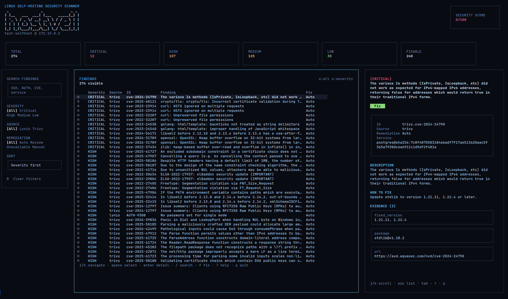
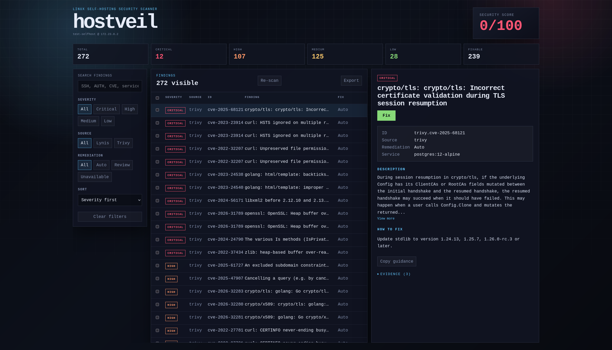
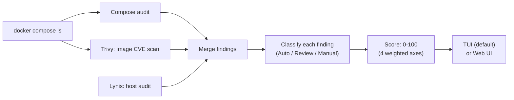

# hostveil

**hostveil finds security problems on your self-hosted Docker host, and fixes them.**
One binary, no config file, no cloud account.

[](https://github.com/seolcu/hostveil/actions/workflows/ci.yml)
[](https://goreportcard.com/report/github.com/seolcu/hostveil)
[](https://github.com/seolcu/hostveil/releases/latest)
[](go.mod)
[](LICENSE)

Point it at a Linux box running Docker Compose. It scans the compose
files, the container images, and the host OS in parallel, merges
everything into one 0–100 score, and gives every finding a fix you
can apply with one keypress.

## Why not just run Trivy and Lynis myself?

You can — they do the CVE scan and the host-hardening scan. hostveil
adds three things neither tool gives you:

1. **One scored list instead of two separate reports.** Trivy's JSON
   and Lynis's report file don't talk to each other. hostveil merges
   both into one list of findings and one 0–100 score, so you don't
   cross-reference two tools by hand.
2. **Docker Compose checks that neither tool runs.** Privileged
   containers, the Docker socket mounted into a container, an exposed
   Redis with no password, a hardcoded secret in `docker-compose.yml`
   — hostveil audits your compose files itself; this is not something
   Trivy or Lynis check.
3. **A fix for almost every finding, not just a report.** Press `f`
   (TUI) or click Fix (Web UI) and hostveil shows exactly what it's
   about to do, then applies it. File edits save a restore point
   first, so `hostveil rollback` can undo them. Trivy and Lynis tell
   you what's wrong; hostveil also changes it.

## Screenshots

<table>
  <tr>
    <td align="center"><b>TUI</b> (default: run <code>hostveil</code>)</td>
    <td align="center"><b>Web UI</b> (run <code>hostveil serve</code>)</td>
  </tr>
  <tr>
    <td></td>
    <td></td>
  </tr>
</table>

## Quick start

```bash
curl -fsSL https://raw.githubusercontent.com/seolcu/hostveil/main/scripts/install.sh | bash
hostveil
```

That's the whole install. The script installs `trivy` and `lynis` if
they're missing, drops the `hostveil` binary into `/usr/bin`, and
`hostveil` re-execs itself via `sudo` because scanning the host needs
root. No config file to write, no account to create.

Prefer a browser to a terminal? Run `hostveil serve` and open
<http://127.0.0.1:8787> instead — same scan, same fixes, same score.

If `trivy` or `lynis` isn't installed, hostveil skips that category
instead of crashing. Run `hostveil setup` any time to install what's
missing.

## What it checks

Three independent backends run in parallel and feed one score:

| Backend | Runs | Catches |
|---|---|---|
| **Compose audit** | Built into hostveil — nothing to install | Privileged containers, the Docker socket mounted into a container, host network mode, exposed unauthenticated datastores (Redis, Mongo, ...) and admin panels (Portainer, phpMyAdmin, ...), missing `no-new-privileges`, no memory/CPU limits, no healthcheck, hardcoded secrets, and more |
| **Image CVEs** | [Trivy](https://github.com/aquasecurity/trivy) | Known vulnerabilities in the exact image tags your compose services run |
| **Host hardening** | [Lynis](https://github.com/CISOfy/lynis) | SSH config, firewall, kernel parameters, file permissions, auditing/logging |

## Commands

The one command you need:

| Command | Does |
|---|---|
| `hostveil` | Scan everything, open the terminal UI |

Everything else is optional:

| Command | Does |
|---|---|
| `hostveil serve` | Scan everything, serve the Web UI at `127.0.0.1:8787` |
| `hostveil setup` | Install or update `trivy`/`lynis` |
| `hostveil update` | Upgrade hostveil itself to the latest release |
| `hostveil history` | List past fixes, each with a restore point |
| `hostveil rollback ID` | Undo a fix, restoring the files it changed |

<details>
<summary>Advanced flags and aliases</summary>

| Command | Does |
|---|---|
| `hostveil --no-scan` | Open the TUI immediately, skip scanning |
| `hostveil web` | Alias for `hostveil serve` |
| `hostveil tui-web` | Open the TUI and serve the Web UI at the same time |
| `hostveil serve --addr HOST:PORT` | Serve the Web UI on a custom address |
| `hostveil serve --cert-file CERT --key-file KEY` | Serve the Web UI over HTTPS |
| `hostveil serve --fixture FILE` | Serve fixture data instead of scanning (used by the E2E tests) |
| `hostveil --no-update` | Skip the startup check for a newer hostveil release |
| `hostveil history show ID` | Show one checkpoint's backed-up files and diff |
| `hostveil history --scans` | List past scans with the score change since the last one |
| `hostveil --version` | Print the installed version |

</details>

## How it works



All three backends scan in parallel. A missing `trivy` or `lynis`
binary just skips that backend — it never blocks the other two or
crashes the scan.

## Understanding the score

<details>
<summary>The score is a weighted sum across four axes, each capped so no single category can dominate. Click to expand the breakdown.</summary>

| Axis | Max penalty | Covers |
|---|---|---|
| Vulnerabilities | 35 | Container image CVEs (Trivy) |
| Container exposure | 30 | Compose misconfigurations (privileged mode, exposed ports, mounts, ...) |
| Host hardening | 25 | Host findings (Lynis) |
| Secrets | 10 | Hardcoded secrets in compose files / `.env` |

Color tier: green ≥ 85, lime ≥ 65, yellow ≥ 40, orange ≥ 20, red < 20.
A fix marked applied stops counting against the score immediately. A
scan with zero findings shows **Clean**, not `100/100` — a perfect
score implies certainty hostveil doesn't have.

</details>

## Remediation kinds

Every finding is labeled with how it can be fixed, not how dangerous
it is — a **Critical** finding can be **Auto**, and a **Low** finding
can be **Manual**, if that's genuinely what the fix requires.

| Kind | Means | Example |
|---|---|---|
| **Auto** | hostveil knows the one correct fix. You still confirm before it applies. | `chmod 640 /etc/shadow` |
| **Review** | More than one valid fix exists, or the fix needs a choice from you. | "Bind to localhost, or remove the port entirely" |
| **Manual** | No fix hostveil can run for you — needs a decision only you can make, or no patch exists yet. | A CVE with no patched version released yet |

<details>
<summary>Why does an Auto fix sometimes show a warning?</summary>

An Auto fix can still warn you about a **side effect** — e.g.
"restarting this service" — without that making it a Review. Review
means there are genuinely multiple correct answers and hostveil can't
pick for you; a warning means there's one correct answer with a
consequence worth knowing about first. Deeper rationale, including the
rule for when a fix must be split into multiple Review options, is in
[`AGENTS.md`](AGENTS.md#remediationkind-classification-rules).

</details>

<details>
<summary>TUI controls</summary>

| Key | Does |
|---|---|
| `j`/`↓`, `k`/`↑` | Move through the findings list |
| `Enter` | Open finding detail |
| `Esc` / `h` | Close detail view |
| `/` | Search findings |
| `f` | Apply a fix (shows a dry-run diff first) |
| `Space` | Select for batch fix |
| `Ctrl+A` | Select/deselect all visible |
| `0`–`4` | Filter by severity (`0`=all, `1`=critical, ...) |
| `s` | Cycle source filter (all → trivy → lynis → compose) |
| `r` | Cycle remediation filter |
| `o` / `O` | Cycle sort order / reverse it |
| `v` | Cycle service filter |
| `R` (twice) | Clear all filters |
| `g` / `G` | Jump to top / bottom |
| `Ctrl+S` | Rescan all tools |
| `Ctrl+R` | Recalculate score |
| `e` | Export the report (JSON/CSV) |
| `?` | Toggle this help |
| `q` | Quit |

</details>

<details>
<summary>Web UI and API</summary>

```bash
hostveil serve                       # http://127.0.0.1:8787
hostveil serve --addr 127.0.0.1:9000 # custom port
```

No Node.js, no npm, no frontend build — `app.js`/`app.css` ship
embedded in the Go binary and are served as-is.

| Endpoint | Method | Does |
|---|---|---|
| `/` | GET | The Web UI |
| `/api/health` | GET | `{"status":"ok"}` |
| `/api/result` | GET | The full scan result as JSON |
| `/api/fix` | POST | Preview (`info_only`) or apply a fix |
| `/api/fix/batch` | POST | Apply fixes for multiple findings |
| `/api/rescan` | POST | Rescan everything |
| `/api/recalc` | POST | Recalculate the score without rescanning |
| `/api/export?format=json\|csv` | GET | Download findings as JSON or CSV |

</details>

## Requirements

- Linux (the binary runs on macOS too, but the Docker checks assume a
  Linux host)
- Docker, with the `docker compose` plugin
- [Trivy](https://github.com/aquasecurity/trivy) and
  [Lynis](https://github.com/CISOfy/lynis) — the installer sets both
  up for you; either is optional, and hostveil skips whichever is
  missing

Host-level scanning needs root. hostveil re-execs itself via `sudo`
automatically — you don't run it as root yourself.

## Security considerations

- hostveil runs as **root** for the duration of a scan (Lynis needs
  to read root-owned system files, and fixes need to write them).
- The Web UI binds to `127.0.0.1:8787` by default — local only. Pass
  `--addr 0.0.0.0:8787` to expose it to your network, and only do
  that on a network you trust; hostveil prints a warning if you do.
- Every fix shows what it's going to do before you confirm — a diff
  for a file edit, the exact command for a shell action. File edits
  save a rollback checkpoint first, so `hostveil rollback` can undo
  them; a shell action (installing a package, a `sysctl -w`) is not
  a file edit and cannot be rolled back the same way.
- hostveil itself only calls GitHub for two things: an update check
  on startup (`--no-update` disables this) and `hostveil update`
  downloading a new release. Separately, `hostveil setup` downloads
  Trivy and Lynis from their own upstream GitHub releases. Nothing
  else leaves the machine — no telemetry, no account.

See [SECURITY.md](SECURITY.md) for the full threat model, including
how the Web UI defends against CSRF and DNS rebinding.

## FAQ

**Is the score deterministic?**
Given the same findings, yes — the scoring formula is pure math.
Trivy's output can shift as its CVE database updates; Lynis is
deterministic for an unchanged system.

**Can I add my own rule?**
Yes — register a `Fix` in `internal/fix/compose.go` (compose
rules), `internal/fix/system.go` (host rules), or
`internal/fix/images.go` (image/CVE rules), and it's classified
automatically. See
[`AGENTS.md`](AGENTS.md#remediationkind-classification-rules).

**Does hostveil keep scanning in the background?**
No. It scans once when you run it, then stops. Scans and fix
checkpoints are saved to `/var/lib/hostveil/` so `hostveil history`
and `hostveil rollback` work later, but nothing runs between scans.

## Documentation

- [docs/ARCHITECTURE.md](docs/ARCHITECTURE.md) — package layout, data
  flow, scoring model, concurrency boundaries
- [docs/DEVELOPMENT.md](docs/DEVELOPMENT.md) — local build/test
  workflow and conventions
- [docs/CONTRIBUTING.md](docs/CONTRIBUTING.md) — filing issues,
  opening a PR, adding a fix rule
- [SECURITY.md](SECURITY.md) — threat model and vulnerability
  reporting
- [CHANGELOG.md](CHANGELOG.md) — release notes
- [AGENTS.md](AGENTS.md) — the repository's actual conventions, for
  humans and AI agents alike

## License

[GPL-3.0](LICENSE)
