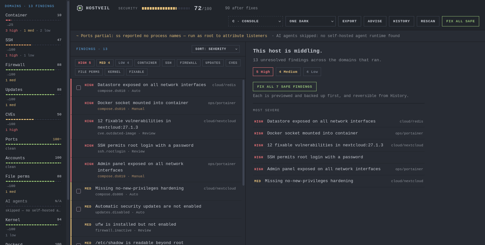
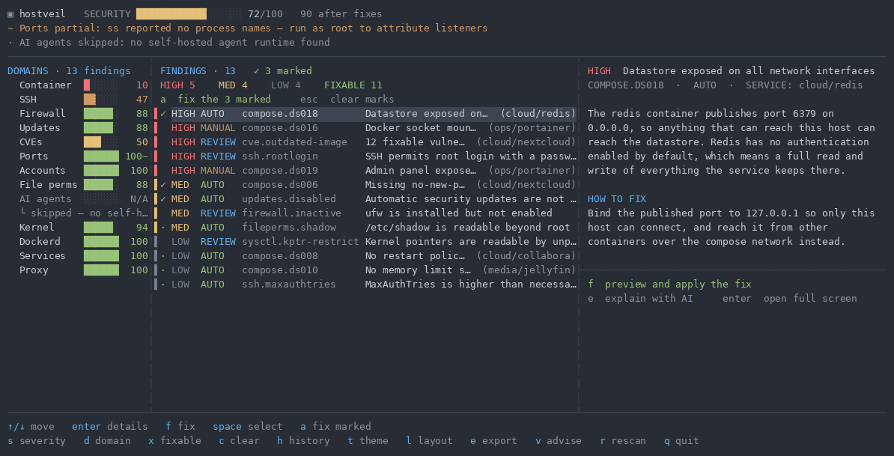

# hostveil

> 2026-1 Ajou SoftCon 개발부문 최우수상 수상

**hostveil finds the security mistakes on your self-hosted Linux server, explains them in plain language, and fixes them safely.**
One binary, no config file, no cloud account.

[](https://github.com/seolcu/hostveil/actions/workflows/ci.yml)
[](https://github.com/seolcu/hostveil/releases/latest)
[](go.mod)
[](LICENSE)
[](https://goreportcard.com/report/github.com/seolcu/hostveil)

[Website](https://hostveil.seolcu.com/) · [Docs](https://hostveil.seolcu.com/docs/) · [Latest release](https://github.com/seolcu/hostveil/releases/latest)

<p align="center">
  
</p>

---

Self-hosting is booming, but most people running Jellyfin, Nextcloud, a
game server, or a local LLM are not security experts — and a single
misconfiguration can turn into a serious breach. hostveil is a **guided
hardening tool** for exactly those people. Point it at a Linux server: it
scans the highest-impact areas, merges everything into one 0–100 score,
explains each finding without jargon, and walks you through fixing it —
showing the exact change, backing up the original first, and letting you
undo any fix with one command.

## What it checks

Every finding is named for the domain that found it, so the prefix in the
second column is what you type into `hostveil fix` and `hostveil explain`.

| Domain | Findings | What it looks at | Needs |
| --- | --- | --- | --- |
| **Docker / Compose** | `compose.*` | Privileged mode, Docker socket mounts, exposed datastores and admin panels, host networking, unsafe bind mounts, shared PID and IPC namespaces, writable root filesystems, missing no-new-privileges, hardcoded secrets, and more — a native audit of your Compose files, plus containers started with plain `docker run` | Docker |
| **SSH** | `ssh.*` | Root login, password authentication, empty passwords, weak brute-force limits, login grace time, gateway ports, host-based and keyboard-interactive auth, X11 forwarding — parsed natively from `sshd_config`, following `Include` into `sshd_config.d/` | — |
| **Firewall** | `firewall.*` | Whether ufw, firewalld, nftables, or iptables is actually active — and whether published container ports are quietly bypassing it | — |
| **Auto-updates** | `updates.*` | Whether unattended-upgrades (apt) or dnf-automatic (dnf) is enabled | — |
| **Exposed services** | `ports.*` | Host processes listening on a non-loopback address — the natively-installed database, admin panel, or app your Compose audit can't see, read from `ss` | `ss` |
| **Accounts** | `accounts.*` | Non-root accounts with root's UID (0) and login accounts with an empty password, parsed from `/etc/passwd` and `/etc/shadow` | root (for `/etc/shadow`) |
| **File permissions** | `fileperms.*` | Over-permissive modes on `/etc/shadow`, `/etc/passwd`, `/etc/group`, `sshd_config`, and SSH host private keys | — |
| **AI agent runtimes** | `agent.*` | Self-hosted agent runtimes — OpenClaw and Hermes Agent: a gateway reachable off-host, authentication turned off on one that is, unrestricted shell and elevated tools, the sandbox disabled, and loose permissions on the config and the API keys beside it | — |
| **Kernel hardening** | `sysctl.*` | Eight kernel parameters read straight from `/proc/sys` — the quiet knobs that stop a local foothold from becoming root and a spoofed packet from becoming a route. No `sysctl` binary needed | — |
| **Docker daemon** | `dockerd.*` | The daemon underneath your containers: an API served over TCP without TLS client verification (unauthenticated root for anyone who can reach the port), a world-writable socket, who holds the socket's group, and the defaults — no-new-privileges, userns-remap, live-restore | Docker |
| **Service hardening** | `systemd.*` | The units you installed yourself, read as systemd's own *effective* configuration: whether a service can gain privileges through setuid, write to `/usr` and `/etc`, read every user's home directory, or share `/tmp` with the rest of the host. Distribution units are left to the distribution | systemd |
| **Image CVEs** *(optional)* | `cve.*` | Known vulnerabilities in the images your Compose services run | Trivy |

Missing Docker or Trivy? Those domains are skipped cleanly and the score is
renormalized so you are never handed a misleadingly perfect result.

## Install

```bash
curl -fsSL https://hostveil.seolcu.com/install.sh | bash
```

Or install a native package from the [latest release](https://github.com/seolcu/hostveil/releases/latest)
— reasonable if you would rather not pipe a script into a shell, especially
for a security tool:

```bash
sudo apt install ./hostveil_<version>_linux_amd64.deb   # or dnf install ./hostveil-<version>.x86_64.rpm
```

The package installs the same binary to the same path (`/usr/bin/hostveil`),
so it and the installer are interchangeable. Docker and `iproute2` are
*recommended*, never required: without them those domains report N/A rather
than hostveil failing.

Or, if you have Go 1.26+ and would rather build it yourself:

```bash
go install github.com/seolcu/hostveil/cmd/hostveil@latest
```

Trivy is optional — install it any time to enable image CVE scanning.

To **upgrade**, re-run the same command: the binary is replaced and your saved
scans and rollback checkpoints are left alone. To **uninstall**:

```bash
curl -fsSL https://hostveil.seolcu.com/install.sh | bash -s -- --uninstall
```

That removes the binary and prints where the state directory is, without
deleting it — those checkpoints are the backups of every file hostveil has
edited on the host, and uninstalling is not a decision to give up the ability
to undo them.

Release archives are built by GitHub Actions and carry a signed build
provenance attestation, so you can confirm a download really came from this
repo's release workflow before running it:

```bash
gh attestation verify hostveil-linux-amd64.tar.gz --repo seolcu/hostveil
```

Each archive also ships an SBOM (`.sbom.json`) listing what went into the
binary.

## Usage

```bash
hostveil                 # interactive TUI (default on a terminal)
hostveil scan            # print a scored report (add -v for details, --json for JSON)
hostveil fix <id>        # preview, then apply the fix for one finding
hostveil fix --all       # apply every safe (Auto) fix at once
hostveil rollback <id>   # undo a previously applied fix
hostveil history         # list applied fixes and their rollback IDs
hostveil explain <id>    # explain a finding (add --ai for a local-LLM second opinion)
hostveil serve           # web dashboard on 127.0.0.1:8787 (open the printed URL)
```

Some checks (SSH, firewall) read root-owned files, and applying fixes needs
root too. So `hostveil` **elevates itself with `sudo` automatically** — you'll
see the same sudo password prompt as `sudo hostveil`, and after authenticating
it continues in the same terminal. `version` and `help` never prompt.

To run unprivileged (scripts/CI), set `HOSTVEIL_NO_SUDO=1`; the root-owned
domains are then skipped with a clear message.

### Using it as a CI or cron gate

`hostveil scan` reports what it found in its exit status, so a scheduled
check needs no output parsing:

| Code | Meaning |
| --- | --- |
| `0` | The scan ran and found nothing Critical or High. |
| `1` | At least one unfixed Critical or High finding. |
| `3` | A detection domain failed outright, so the scan covered less of the host than it should have. |

```bash
HOSTVEIL_NO_SUDO=1 hostveil scan --json > report.json || echo "action needed"
```

`--sarif` emits SARIF 2.1.0 instead — the format GitHub code scanning and most
CI systems ingest — with one rule per finding ID and a stable fingerprint per
finding, so a consumer can track one across scans. The score and per-domain
coverage ride in the run's properties, because a SARIF file with no results
from a scan that could not look would otherwise read as a clean host.
`--output FILE` writes whichever format you picked, and the exit status does
not vary by format or destination — the contract is the exit code.

`--only` and `--skip` scope a run to some domains (`--only ssh,firewall`). The
domains that did not run report N/A, never 100, and a partial scan is
deliberately not saved as the baseline for the next delta.

Code **3** matters more than it looks. A failed domain contributes no
findings, so without it an unreachable Docker socket silences the two
heaviest axes and the pipeline sees a clean run — a blind scan and a healthy
host are indistinguishable to the one consumer that never reads the output.
A domain skipped for a missing dependency, or degraded to partial coverage,
does not change the status; both are reported in the output instead.

Other commands exit 0 on success, 1 on failure, and 2 on a usage error.

### When something looks wrong

Set `HOSTVEIL_DEBUG=1` to trace every command hostveil runs against the host —
what ran, how long it took, and whether it failed — to stderr:

```bash
HOSTVEIL_DEBUG=1 hostveil scan
```

That is the right thing to attach to a bug report about a domain being skipped
or a check reporting the wrong thing. Command *output* is deliberately never
logged: `docker inspect` reports the resolved environment of every container,
so a trace that included it would routinely be a credential leak.

See [Troubleshooting](https://hostveil.seolcu.com/docs/troubleshooting) for what
Degraded, a declined rollback, an empty history, and exit code 3 mean.

## How fixing works

Every finding is classified so the tool never mutates blindly:

- **Auto** — one clearly-correct change. You still see it first.
- **Review** — several valid alternatives; you choose one.
- **Manual** — no safe automation; hostveil explains what to do instead.

Applying a fix always **shows the exact diff or command**, **backs up the
original file to a checkpoint**, then applies it. `hostveil rollback`
restores the backup — and because every UI (CLI, TUI, web) goes through the
same engine, a fix applied anywhere is reversible.

## Interfaces

<p align="center">
  
</p>

- **TUI** — keyboard-driven, the default when you run `hostveil` on a terminal.
- **Web** — `hostveil serve`, a localhost-bound dashboard. It prints a URL
  carrying a one-off access token; open that exact URL. Loopback keeps the
  dashboard off the network, but not away from other accounts on the same
  machine — and it runs as root. For remote access, forward the port over SSH
  rather than changing `--addr`, which cannot expose it.
- **CLI** — scriptable `scan` / `fix` / `rollback` with `--json` output.

All three are thin layers over one shared engine, so they behave identically.

The TUI and the dashboard share five color themes — `onedark` (the
default), `gruvbox`, `nord`, `catppuccin`, `tokyonight`. Press `t` in the TUI
to pick one and have it remembered, use the picker in the dashboard's status
bar, or set it explicitly with `--theme nord` or `HOSTVEIL_THEME=nord`.

The TUI and `scan` can also draw their status markers from a patched
[Nerd Font](https://www.nerdfonts.com/) — `--glyphs nerd`, or
`HOSTVEIL_GLYPHS=nerd` once. It is opt-in rather than detected, because a
terminal cannot be asked what font it is using and a missing glyph is drawn
in the same single cell a present one would be. The default set is plain
Unicode and renders everywhere.

Any Nerd Font build works — Mono or not. The symbols are drawn from the
Font Awesome block, which is present in every patched font and one cell wide
in all of them; the glyphs that go double-width in a non-Mono build are the
Powerline and icon ranges, which hostveil does not use.

## AI (optional, advisory only)

`hostveil explain <id> --ai` adds a plain-language explanation from a local
LLM (Ollama by default), so nothing leaves your host. AI is strictly
advisory — it never applies changes — and every explanation, score, and fix
works with no AI at all.

## How it compares

Most server-hardening tools are auditors: they hand you a report and leave the
fixing to you. hostveil is built to close that loop for people who aren't
security experts.

- **[Lynis](https://github.com/CISOfy/lynis)** is a thorough, expert-oriented
  host auditor. It prints a long list of suggestions but doesn't apply them,
  and reading the output assumes you already know which ones matter.
- **[docker-bench-security](https://github.com/docker/docker-bench-security)**
  checks a Docker host against the CIS benchmark. It's container-only, and it
  reports rather than fixes.
- **[Trivy](https://github.com/aquasecurity/trivy)** scans images and
  filesystems for known CVEs and misconfigurations. It's excellent at that one
  job — hostveil actually *runs* Trivy for its CVE domain — but it doesn't look
  at your SSH config, firewall, or accounts.

hostveil's angle is to merge the host, your containers, and image CVEs into a
single 0–100 score, explain each finding in plain language, and then **apply
the fix** — with a preview, a backup, and one-command rollback. One binary, and
no report to interpret.

## Build from source

```bash
go build ./cmd/hostveil
go test ./...
```

See [docs/DEVELOPMENT.md](docs/DEVELOPMENT.md) for full setup (per-platform
demo VM, repo layout, contributing checklist).

## License

[GPL-3.0](LICENSE)

> Team 내컴퓨터누가해킹했어 ([@gkdms04](https://github.com/gkdms04), [@seolcu](https://github.com/seolcu))
